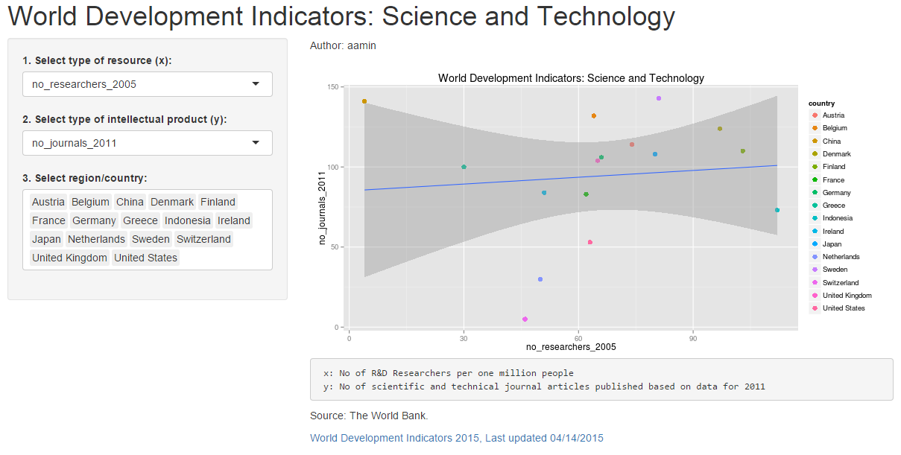

## Introduction

The World Development Indicators is the primary World Bank collection of development indicators, compiled from officially-recognized international sources. It presents the most current and accurate global development data available, and includes national, regional and global estimates.

This document presents the relationships between World Development Indicators in the field of Science and Technology.

The dataset is retrieved from [World Development Indicators 2015, Last updated 14/04/2015](http://wdi.worldbank.org/table/5.13)

The Shiny app can be found [here](https://aamin.shinyapps.io/scienceandtechnology/).

Source code can be found in [Github] (https://aamin)

--- .class #id 

## Dataset

The data consists of 227 rows, of 12 variables: country/region, number of researchers, number of technicians, numbers of journal articles produced, R&D expenditures (in %GDP), R&D expenditures (in millions $), % of manufactured export, IP receipts, IP payments, total patents resident and non resident, and total trademark.

Data processing consist of several steps:

* Data clean up: assign column names, remove foot notes at the end of the data file.
* Format each column into the correct data type (string or numeric)

--- .class #id 

## Dataset (part 2)


```
## 'data.frame':	320 obs. of  12 variables:
##  $ country                            : chr  "Afghanistan" "Albania" "Algeria" "American Samoa" ...
##  $ no_researchers_2005                : num  NA 22 27 17 NA 90 NA 5 NA NA ...
##  $ no_technicians_2005                : num  NA 57 52 NA NA 62 NA 45 NA NA ...
##  $ no_journals_2011                   : num  137 72 121 NA 3 122 2 83 47 NA ...
##  $ rd_expenditures_percent_gdp_2005   : num  NA 0.15 0.07 NA NA NA NA 0.65 0.27 NA ...
##  $ rd_expenditures_in_mdollars_2013   : num  NA 85 57 NA NA NA 2 43 115 39 ...
##  $ percent_of_manufactured_export_2013: num  NA 0.5 0.2 NA NA NA 0 9.8 2.9 10.2 ...
##  $ ip_receipts_mdollar_2013           : num  2 3 3 NA NA NA NA 18 NA 2 ...
##  $ ip_payments_mdollar_2013           : num  89 45 26 NA NA 30 3 35 NA 109 ...
##  $ total_patent_resident_2013         : num  NA 63 26 NA NA NA NA 92 28 NA ...
##  $ total_patent_nonresident_2013      : num  NA 74 107 NA NA NA 105 76 96 NA ...
##  $ total_trademark_2013               : num  NA 75 79 NA 129 NA 137 145 101 NA ...
## NULL
```


--- .class #id 

## What the application looks like

</img>

Follow the simple steps on the left side: a) select the indicators for X and Y axis and b) select region/country of interest.


